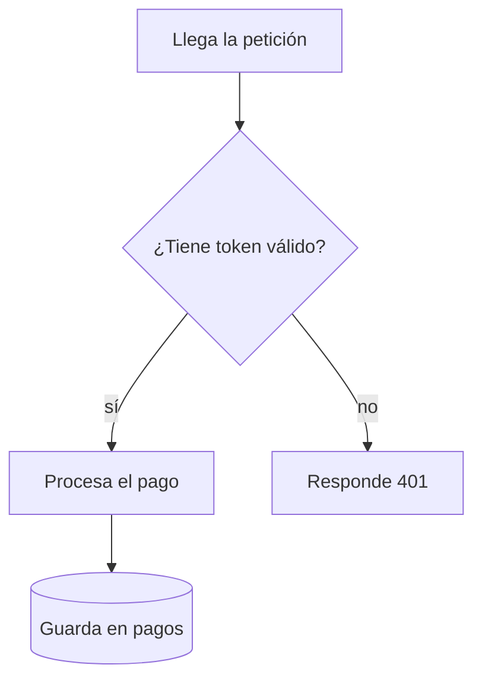
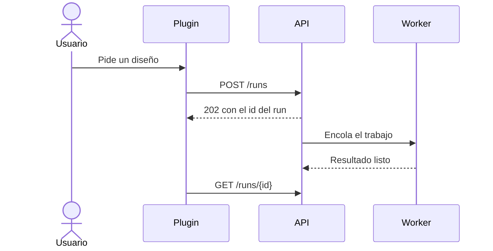

## Cómo se escribe un buen resumen

Un resumen de SaveMe es **documentación**, no un acta. Quien lo abra dentro de seis
meses —el propio usuario, alguien nuevo en el equipo, otro agente— tiene que entender
qué se hizo, por qué, cómo funciona y cómo retomarlo **sin abrir el chat ni el diff**.
Si para entenderlo hace falta haber estado en la conversación, el resumen no sirve.

### Lo primero: qué quiere guardar el usuario

Si el usuario te dijo qué guardar («guarda cómo funciona el flujo de pagos», «documenta
la decisión de usar colas»), **eso es el centro del resumen**, aunque en la sesión se
hicieran más cosas. Si no lo dijo y la sesión tocó varios temas, pregúntale cuál le
interesa o propón un resumen por tema.

### Cuánto detalle

El detalle va con la importancia del cambio, no con su número de líneas:

- **Cambio pequeño y obvio** (una errata, subir una versión): un párrafo honesto.
- **Fix con causa no evidente**: síntoma, causa raíz, arreglo y cómo se comprobó.
- **Feature, decisión de diseño, investigación o incidente**: un documento completo,
  con diagramas donde ayuden.

Ante la duda, explica más. Lo que hoy parece obvio es justo lo que se olvida primero.

### Estructura

Usa las secciones que apliquen y omite las que no aporten; no rellenes por rellenar.

```markdown
## Contexto
La situación de partida: qué problema había o qué se pedía, para quién, y las
restricciones que condicionaron la solución (tiempo, compatibilidad, coste…).

## Qué se hizo
Los cambios concretos, en pasado y agrupados por pieza (API, interfaz, base de
datos, infraestructura…). Una lista está bien si cada punto dice algo.

## Por qué
Las decisiones y su motivo. Las alternativas que se descartaron y por qué. Es lo
que siempre se olvida y lo que más se agradece después.

## Cómo funciona
El recorrido de principio a fin: qué piezas intervienen, en qué orden, dónde vive
el código (las rutas que importan), qué datos se mueven y qué invariantes hay que
respetar. Aquí suelen ir los diagramas.

## Cómo usarlo y cómo verificarlo
Los comandos, variables de entorno, endpoints o pasos concretos, y el resultado
que se espera ver.

## Qué falta y riesgos
Lo que quedó a medias, lo que se decidió no hacer, los límites conocidos y lo que
podría romperse.

## Referencias
Archivos clave, PRs, issues, documentación externa.
```

Según la categoría conviene otra forma:

- **incident** — Impacto (a quién y cuánto tiempo), Línea de tiempo, Causa raíz, Arreglo,
  Cómo evitar que se repita.
- **research** — Pregunta, Opciones comparadas (una tabla), Conclusión y recomendación,
  Lo que quedó sin responder.
- **design** — Contexto, Decisión, Alternativas consideradas, Consecuencias (lo que se
  gana y lo que se paga).
- **perf** — Qué iba lento o gastaba de más, Cifras de antes y después (y cómo se
  midieron), Dónde estaba el coste, Qué se cambió, Qué se sacrificó a cambio.
- **security** — Qué riesgo había y a quién afectaba, Cómo se podía explotar (sin una
  receta paso a paso), Arreglo, Cómo se verificó, Qué más conviene revisar.

Si aparecen términos del dominio que no todo el mundo conoce, añade un **Glosario** en
una tabla de dos columnas: término y qué es.

### Diagramas

SaveMe pinta los bloques ` ```mermaid ` como diagramas. Úsalos cuando el texto solo
obligaría a imaginar algo que se ve mejor dibujado: un flujo con decisiones, varias
piezas hablándose, un ciclo de estados. Elige el tipo según lo que haya que contar:

| Para contar… | Usa |
| --- | --- |
| un proceso, un pipeline, una decisión con ramas | `flowchart TD` (o `LR`) |
| quién llama a quién y en qué orden (usuario, API, cola, worker…) | `sequenceDiagram` |
| los estados por los que pasa algo (un pedido, un job, una propuesta) | `stateDiagram-v2` |
| tablas y relaciones de un modelo de datos | `erDiagram` |
| la estructura de clases o tipos, si de verdad es la clave | `classDiagram` |
| una cronología (incidentes, migraciones por fases) | `timeline` |

Un flujo:



Una secuencia:



Reglas para que el diagrama ayude y no estorbe:

- **Una idea por diagrama** y como mucho unos 15 nodos. Si no cabe, divide.
- El diagrama **acompaña al texto, no lo sustituye**: una frase antes que diga qué
  enseña.
- Etiquetas en el idioma del usuario. Los identificadores de nodo, cortos y sin
  espacios ni acentos (`A`, `api`, `worker`).
- Pon entre comillas las etiquetas con paréntesis, dos puntos u otros signos:
  `A["Plugin (Figma)"]`. No uses `end` como identificador en un flowchart.
- Nada de diagramas para cambios triviales ni para decorar. Mejor uno bueno que tres.

### Estilo

- Escribe **en el idioma del usuario**.
- Empieza por el contenido. Nada de «en este documento se describe…».
- Frases claras, voz activa, términos precisos.
- Usa los nombres reales —rutas, comandos, endpoints, variables, flags— cuando sirvan
  para retomar el trabajo, y explica qué son la primera vez que aparecen.
- Un fragmento de código corto está bien si enseña la idea clave. No pegues diffs ni
  listes cada archivo tocado: para eso está git. Usa `files_touched` para los archivos
  que de verdad importan.
- Usa tablas para comparar y listas para pasos; el resto, en prosa.
